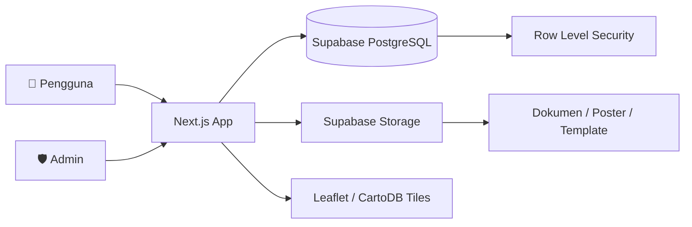
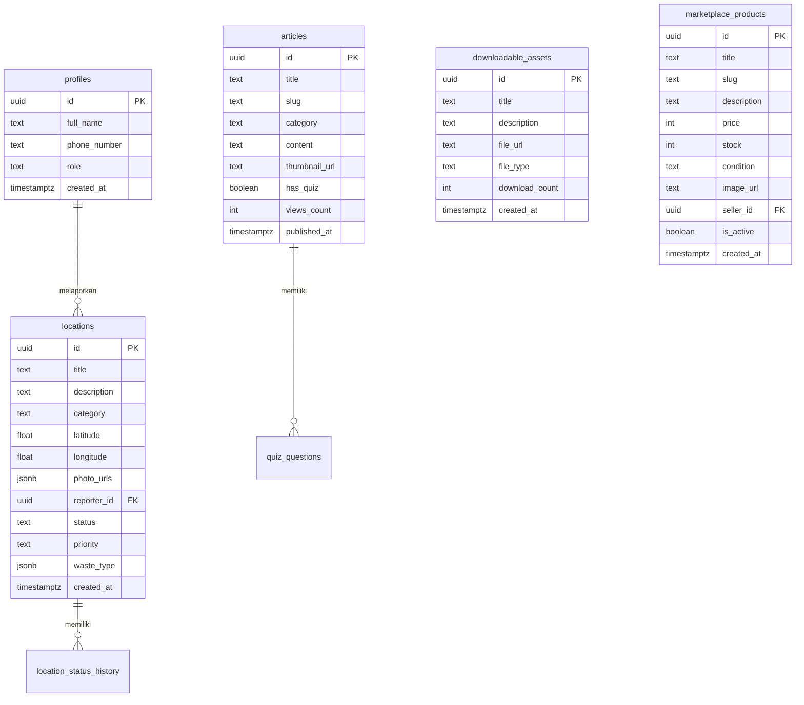

<div align="center">

# ♻️ RecoveryKita

### Platform Manajemen & Analitik Pengolahan Sampah Perkotaan Berbasis Peta Intuitif

[](https://recoverykita.vercel.app)
[](https://github.com/MahvOS/recoverykita)
[](LICENSE)

**Submission for ITECHNO CUP 2026 - Web Development**

**By PAPAN ATAS!**

</div>

---

## 📋 Daftar Isi

- [Tim Developer](#-tim-developer)
- [Tentang Proyek](#-tentang-proyek)
- [Fitur Unggulan](#-fitur-unggulan)
- [Demo & Screenshot](#-demo--screenshot)
- [Teknologi](#-teknologi)
- [Arsitektur Sistem](#-arsitektur-sistem)
- [Instalasi & Setup](#-instalasi--setup)
- [Penggunaan](#-penggunaan)
- [API & Server Actions](#-api--server-actions)
- [Lisensi](#-lisensi)

---

## 👥 Tim Developer

| Nama                       | Peran                              | GitHub                                                                           |
| -------------------------- | ---------------------------------- | -------------------------------------------------------------------------------- |
| **Mahvin Aflah Mulyana**   | Project Lead & Fullstack Developer | [@MahvOS](https://github.com/MahvOS)                                             |
| **Sulthan Fatin Aditya**   | Frontend Developer                 | [@burungbekicotningmagetan-rgb](https://github.com/burungbekicotningmagetan-rgb) |
| **Muhammad Adzka Mumtaza** | UI/UX Designer                     | [@HumanitySX](https://github.com/HumanitySX)                                     |

---

## 🎯 Tentang Proyek

### Latar Belakang

Penumpukan sampah ilegal di area perkotaan sering kali tidak terdeteksi dengan cepat oleh pihak berwenang karena terbatasnya sistem pelaporan warga yang terintegrasi secara real-time. Selain itu, penanganan sampah sering kali bersifat reaktif tanpa adanya pemetaan wilayah rawan (Red Zone) berbasis data analitik.

### Solusi yang Ditawarkan

**RecoveryKita** hadir sebagai platform _crowdsourced waste management_ yang memungkinkan warga melaporkan titik sampah liar secara visual berbasis peta, serta menyediakan **Dashboard Admin & Analitik** bagi pihak pengelola untuk memantau kluster titik rawan (Hotspot & Red Zone) secara efisien.

### Tujuan Proyek

- 🎯 **Tujuan Utama**: Mempercepat respon penanganan sampah liar melalui transparansi data lokasi berbasis geospatial.
- 📊 **Target Pengguna**: Masyarakat umum (Pelapor), Tim Kebersihan/Komunitas (Eksekutor), dan Admin Pengelola (Analitikal).
- 💡 **Value Proposition**: Algoritma otomatisasi deteksi Red Zone berbasis pembulatan titik koordinat (_clustering_) dan pemetaan visual real-time.

---

## ✨ Fitur Unggulan

### Fitur Utama

| Fitur                           | Deskripsi                                                                             | Keunggulan                                                             |
| ------------------------------- | ------------------------------------------------------------------------------------- | ---------------------------------------------------------------------- |
| **Pelaporan Berbasis Peta**     | Warga dapat menandai titik lokasi sampah secara presisi beserta bukti foto.           | Otomatis membaca koordinat geografis dari lokasi pengguna.             |
| **Analitik Red Zone / Hotspot** | Mengelompokkan titik-titik laporan berdekatan ke dalam kategori risikonya.            | Area dengan ≥ 3 laporan aktif otomatis memicu status _Red Zone_.       |
| **Dashboard Admin**             | Panel kontrol untuk memantau daftar pengguna, laporan masuk, serta status penanganan. | Dilengkapi kontrol verifikasi dan aksi cepat penanganan sampah.        |
| **Peta Interaktif**             | Visualisasi spasial berbasis Leaflet & CartoDB yang ringan dan responsif.             | Mendukung heatmap dan marker kluster tanpa beban bandwidth tinggi.     |
| **Pasar Barang Bekas**          | Marketplace untuk barang bekas layak pakai yang mendukung ekonomi sirkular.           | Memudahkan warga jual beli barang bekas secara daring.                 |
| **Edukasi Lingkungan**          | Katalog artikel dan kuis edukasi tentang daur ulang, kompos, dan zero waste.          | Meningkatkan kesadaran masyarakat seputar pengelolaan sampah.          |
| **Download Panduan & Poster**   | Materi edukasi siap cetak dalam format DOCX, JPEG, dan XLSX.                          | Dapat diunduh langsung untuk kebutuhan RT/RW, sekolah, atau komunitas. |

---

## 📸 Demo & Screenshot

### Live Demo

🔗 **[Kunjungi RecoveryKita](https://recoverykita.vercel.app)**

### Screenshot Aplikasi

<div align="center">
  
  <p><em>Peta Interaktif Pelaporan Sampah Warga</em></p>

  
  <p><em>Dashboard Analitik Admin & Pemetaan Red Zone</em></p>
</div>

---

## 🛠️ Teknologi

### Tech Stack

#### Frontend

```
Framework    : Next.js 16.3 (App Router)
Language     : TypeScript
Runtime      : React 19.2
Styling      : Tailwind CSS v4
Icons        : Lucide React 1.33.0
Maps         : Leaflet 1.9.4
State        : React Context API + useState/useEffect
```

#### Backend

```
Runtime      : Node.js
Database     : Supabase (PostgreSQL)
Auth         : Supabase Auth (Email/Password)
Storage      : Supabase Storage
Realtime     : Supabase Realtime (optional)
```

#### DevOps & Tools

```
Deployment   : Vercel
Linting      : ESLint 9 + Prettier
Type Checking: TypeScript 5
Package Mgr  : npm
```

### Alasan Pemilihan Teknologi

| Teknologi           | Alasan Pemilihan                                                                                       |
| ------------------- | ------------------------------------------------------------------------------------------------------ |
| **Next.js 16**      | Framework React terbaik untuk production dengan App Router, Server Components, dan optimasi bawaan.    |
| **Tailwind CSS v4** | Utility-first CSS yang cepat untuk prototyping dan mempertahankan konsistensi UI.                      |
| **Supabase**        | Backend-as-a-Service lengkap (PostgreSQL, Auth, Storage, RLS) yang memangkas kebutuhan backend custom. |
| **Leaflet**         | Library peta ringan, open-source, dan mudah diintegrasikan dengan React untuk visualisasi geospasial.  |
| **Lucide React**    | Ikon konsisten, ringan, dan modern yang selaras dengan desain Tailwind.                                |

### Dependencies Utama

```json
{
  "dependencies": {
    "@supabase/ssr": "^0.12.4",
    "@supabase/supabase-js": "^2.112.3",
    "@types/leaflet": "^1.9.22",
    "leaflet": "^1.9.4",
    "lucide-react": "^1.33.0",
    "next": "16.3.0",
    "react": "19.2.8",
    "react-dom": "19.2.8"
  },
  "devDependencies": {
    "@tailwindcss/postcss": "^4",
    "@types/node": "^20",
    "@types/react": "^19",
    "@types/react-dom": "^19",
    "eslint": "^9",
    "eslint-config-next": "16.3.0",
    "prettier": "3.9.6",
    "tailwindcss": "^4",
    "typescript": "^5"
  }
}
```

---

## 🏗️ Arsitektur Sistem

### System Architecture



### Database Schema



### Folder Structure

```
project-root/
├── app/
│   ├── admin/                   # Admin dashboard & management pages
│   ├── edukasi/                 # Education articles, quiz, downloadable assets
│   ├── lapor/                   # Waste report form & map
│   ├── marketplace/             # Marketplace product pages
│   ├── peta/                    # Interactive map view
│   └── layout.tsx               # Root layout
├── components/
│   ├── admin/                   # Admin-specific components (sidebar, maps, tables)
│   ├── Quiz/                    # Interactive quiz components
│   └── *.tsx                    # Shared UI components
├── hooks/                       # Custom React hooks
├── actions/                     # Server Actions (mapActions, userActions)
├── types/                       # TypeScript type definitions
├── lib/                         # Supabase client & shared utilities
├── public/                      # Static assets (images, documents, posters, templates)
├── isi_artikel/                 # Article markdown/content files
├── package.json                 # Dependencies & scripts
├── tsconfig.json                # TypeScript configuration
├── next.config.ts               # Next.js configuration
└── README.md                    # Project documentation
```

---

## ⚙️ Instalasi & Setup

### Prerequisites

Pastikan Anda telah menginstall:

- **Node.js** (v18.x atau lebih tinggi)
- **npm** / **yarn** / **pnpm**
- **Git**

### Langkah Instalasi

#### 1️⃣ Clone Repository

```bash
git clone https://github.com/[username]/[repo-name].git
cd [repo-name]
```

#### 2️⃣ Install Dependencies

```bash
# Menggunakan npm
npm install

# Atau menggunakan yarn
yarn install

# Atau menggunakan pnpm
pnpm install
```

#### 3️⃣ Setup Environment Variables

Buat file `.env.local` di root directory:

```env
# Supabase
NEXT_PUBLIC_SUPABASE_URL="[your_supabase_url]"
NEXT_PUBLIC_SUPABASE_PUBLISHABLE_KEY="[your_supabase_anon_key]"
```

#### 4️⃣ Setup Database

Jalankan SQL schema Supabase yang tersedia di dokumentasi proyek untuk membuat tabel: `profiles`, `locations`, `location_status_history`, `articles`, `quiz_questions`, `downloadable_assets`, `marketplace_products`, `carbon_factors`, dan `waste_lookup_guides`.

#### 5️⃣ Upload Assets

Letakkan file panduan dan poster di folder:

- `public/documents/` untuk file DOCX/PDF
- `public/posters/` untuk poster JPEG/PNG
- `public/templates/` untuk template XLSX

#### 6️⃣ Run Development Server

```bash
npm run dev
```

Aplikasi akan berjalan di `http://localhost:3000`

---

## 🚀 Penggunaan

### Menjalankan Aplikasi

```bash
# Development mode
npm run dev

# Production build
npm run build
npm run start

# Linting
npm run lint
```

### User Guide

#### Untuk Pengguna Umum

1. **Pelaporan Sampah**: Buka halaman **Lapor**, login/register, klik peta untuk menentukan lokasi, upload foto bukti, pilih jenis sampah, dan kirim laporan.
2. **Peta Interaktif**: Buka halaman **Peta** untuk melihat semua laporan, filter berdasarkan jenis/prioritas, dan lihat detail laporan.
3. **Edukasi**: Buka halaman **Edukasi** untuk membaca artikel, mengerjakan kuis, dan mengunduh panduan/poster siap cetak.
4. **Marketplace**: Buka halaman **Marketplace** untuk menjual atau membeli barang bekas layak pakai.

#### Untuk Admin

1. **Akses Admin Panel**: Buka `/admin` setelah login sebagai admin.
2. **Kelola Laporan Peta**: Lihat daftar laporan, ubah status penanganan, dan deteksi hotspot/red zone.
3. **Kelola Edukasi**: Tambah, edit, dan hapus artikel edukasi beserta kuisnya.
4. **Kelola Marketplace**: Verifikasi dan kelola produk yang dijual warga.

---

## 📚 API Documentation

### Base URL

```
Development: http://localhost:3000
Production:  https://recoverykita.vercel.app
```

### Server Actions

Proyek ini menggunakan **Next.js Server Actions** untuk operasi data, di antaranya:

#### Waste Reports

- `getHotspotClusters()` - Mengambil kluster hotspot dari Supabase
- `deleteReportAction(id)` - Menghapus laporan sampah
- `updateReportStatus(id, status)` - Memperbarui status laporan

#### User Management

- `approveUser(userId, approve)` - Menyetujui/menolak verifikasi pengguna
- `setUserRole(userId, role)` - Mengubah role pengguna

### Database Tables

| Table                     | Description                                 |
| ------------------------- | ------------------------------------------- |
| `profiles`                | Data profil pengguna                        |
| `locations`               | Laporan titik sampah                        |
| `location_status_history` | Riwayat perubahan status laporan            |
| `articles`                | Artikel edukasi                             |
| `quiz_questions`          | Pertanyaan kuis edukasi                     |
| `downloadable_assets`     | Aset unduhan (dokumen, poster, template)    |
| `marketplace_products`    | Produk marketplace                          |
| `carbon_factors`          | Faktor emisi karbon per jenis sampah        |
| `waste_lookup_guides`     | Panduan daur ulang berdasarkan jenis sampah |

---

## 🧪 Testing

### Running Tests

```bash
# Unit tests
npm run test

# Integration tests
npm run test:integration

# E2E tests
npm run test:e2e

# Test coverage
npm run test:coverage
```

### Test Coverage

```
Statements   : XX%
Branches     : XX%
Functions    : XX%
Lines        : XX%
```

---

## 📄 Lisensi

Proyek ini dilisensikan di bawah [MIT License](LICENSE) - lihat file LICENSE untuk detail lebih lanjut.

---

<div align="center">

**Made with ❤️ by PAPAN ATAS! for ITECHNO CUP 2026**

</div>
