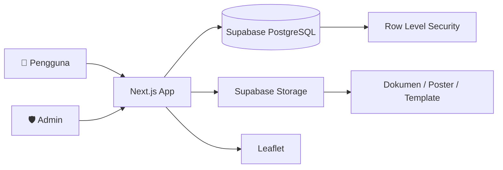
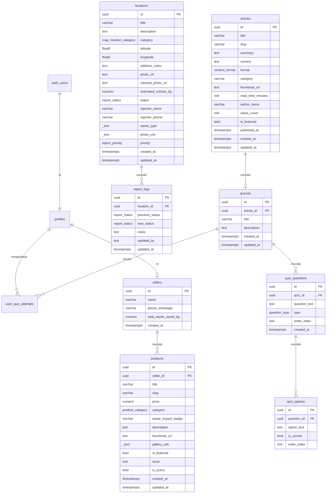

<div align="center">

# ♻️ RecoveryKita

### Platform Manajemen & Analitik Pengolahan Sampah Perkotaan Berbasis Peta Intuitif

[](https://recoverykita.vercel.app)
[](https://github.com/MahvOS/recoverykita)
[](LICENSE)

**Submission for ITECHNO CUP 2026 - Web Development**

**By PAPAN ATAS!**

> 🔑 **Catatan Akses Admin (Penguji / Juri):**
> Kredensial khusus untuk mengakses Dashboard Admin telah dikirimkan secara langsung melalui WhatsApp ke **Kak Reza**. Silakan periksa pesan privat untuk informasi login.

</div>

---

## 📋 Daftar Isi

- [Tim Developer](#-tim-developer)
- [Tentang Proyek](#-tentang-proyek)
- [Fitur Unggulan](#-fitur-unggulan)
- [Demo & Screenshot](#-demo--screenshot)
- [Teknologi](#-teknologi)
- [Arsitektur Sistem](#-arsitektur-sistem)
- [Instalasi & Setup](#-instalasi--setup)
- [Penggunaan](#-penggunaan)
- [API & Server Actions](#-api--server-actions)
- [Lisensi](#-lisensi)

---

## 👥 Tim Developer

| Nama                       | Peran                              | GitHub                                                                           |
| -------------------------- | ---------------------------------- | -------------------------------------------------------------------------------- |
| **Mahvin Aflah Mulyana**   | Project Lead & Fullstack Developer | [@MahvOS](https://github.com/MahvOS)                                             |
| **Sulthan Fatin Aditya**   | Frontend Developer                 | [@burungbekicotningmagetan-rgb](https://github.com/burungbekicotningmagetan-rgb) |
| **Muhammad Adzka Mumtaza** | UI/UX Designer                     | [@HumanitySX](https://github.com/HumanitySX)                                     |

---

## 🎯 Tentang Proyek

### Latar Belakang

Menurut laporan resmi World Bank, 40% warga perkotaan di Indonesia tidak memiliki akses ke layanan pengumpulan sampah dasar, yang mendorong timbulnya titik-titik pembuangan ilegal (illegal dumping). dan berdasarkan data dari SIPSN KLHK (Sistem Informasi Pengelolaan Sampah Nasional) Sekitar 31% - 35% sampah nasional belum terkelola dengan baik dan terbuang ke lingkungan/TPS liar. Permasalahan ini secara langsung mendesak pencapaian sasaran Pembangunan Berkelanjutan (SDGs), khususnya SDG 11: Kota dan Pemukiman yang Berkelanjutan (Target 11.6) — Memperbaiki pengelolaan sampah perkotaan dan mengurangi dampak lingkungan negatif per kapita.

### Solusi yang Ditawarkan

**RecoveryKita** hadir sebagai platform _crowdsourced waste management_ yang mendukung pencapaian SDG 11 (Kota & Pemukiman Berkelanjutan). Platform ini memungkinkan warga melaporkan titik sampah liar secara visual berbasis peta, serta menyediakan **Dashboard Admin & Analitik** bagi pihak pengelola untuk memantau kluster titik rawan (Hotspot & Red Zone) secara efisien.

### Tujuan Proyek

- 🎯 **Tujuan Utama**: Mempercepat respon penanganan sampah liar melalui transparansi data lokasi berbasis geospatial.
- 📊 **Target Pengguna**: Masyarakat umum (Pelapor), Tim Kebersihan/Komunitas (Eksekutor), dan Admin Pengelola (Analitikal).
- 💡 **Value Proposition**: Algoritma otomatisasi deteksi Red Zone berbasis pembulatan titik koordinat (_clustering_) dan pemetaan visual real-time.

---

## ✨ Fitur Unggulan

### Fitur Utama

| Fitur                           | Deskripsi                                                                                   | Keunggulan                                                             |
| ------------------------------- | ------------------------------------------------------------------------------------------- | ---------------------------------------------------------------------- |
| **Pelaporan Berbasis Peta**     | Warga dapat menandai titik lokasi sampah secara presisi beserta bukti foto.                 | Otomatis membaca koordinat geografis dari lokasi pengguna.             |
| **Kontrol Laporan Pribadi**     | User dapat menandai laporannya sendiri sebagai selesai atau menghapusnya dari popup marker. | Aksi dibatasi dengan `reporter_id` dan konfirmasi sebelum penghapusan. |
| **Analitik Red Zone / Hotspot** | Mengelompokkan titik-titik laporan berdekatan ke dalam kategori risikonya.                  | Area dengan ≥ 3 laporan aktif otomatis memicu status _Red Zone_.       |
| **Dashboard Admin**             | Panel kontrol untuk memantau daftar pengguna, laporan masuk, serta status penanganan.       | Dilengkapi kontrol verifikasi dan aksi cepat penanganan sampah.        |
| **Peta Interaktif**             | Visualisasi spasial berbasis Leaflet & CartoDB yang ringan dan responsif.                   | Mendukung heatmap dan marker kluster tanpa beban bandwidth tinggi.     |
| **Pasar Barang Bekas**          | Marketplace untuk barang bekas layak pakai yang mendukung ekonomi sirkular.                 | Memudahkan warga jual beli barang bekas secara daring.                 |
| **Edukasi Lingkungan**          | Katalog artikel dan kuis edukasi tentang daur ulang, kompos, dan zero waste.                | Meningkatkan kesadaran masyarakat seputar pengelolaan sampah.          |
| **Download Panduan & Poster**   | Materi edukasi siap cetak dalam format DOCX, JPEG, dan XLSX.                                | Dapat diunduh langsung untuk kebutuhan RT/RW, sekolah, atau komunitas. |

---

## 📸 Demo & Screenshot

### Live Demo

🔗 **[Kunjungi RecoveryKita](https://recoverykita.vercel.app)**
<video src="" width="100%" controls></video>

https://github.com/user-attachments/assets/90339ec6-9eae-4b74-94b4-be1b52b4d656

## 🎥 Video Demo & Showcase

[](https://youtu.be/kG0JGNdoSvs)

> 🎬 **Tonton Demo Video:** [RecoveryKita Website Short Demo di YouTube](https://youtu.be/kG0JGNdoSvs)

Dalam video demo di atas, dipresentasikan beberapa fitur utama platform **RecoveryKita**:

- 🗺️ **Fitur Peta**: Pemetaan interaktif sebaran titik sampah liar, bank sampah, dan aksi komunitas.
- 📝 **Fitur Lapor**: Pelaporan lokasi titik sampah baru secara langsung ke peta.
- 🛍️ **Fitur Marketplace Sirkular**: Produk daur ulang buatan pengrajin lokal lengkap dengan indikator _kilogram limbah yang diselamatkan_.
- 📚 **Fitur Edukasi**: Artikel isu lingkungan, panduan interaktif pemilahan sampah, dan kalkulator emisi karbon.
- 💡 **Fitur Kuis Interaktif**: Uji pemahaman langsung dari materi artikel edukasi yang dibaca.

---

🌐 _Untuk mencoba langsung dan menjelajahi fitur selengkapnya, kunjungi platform kami di:_ *_[recoverykita.vercel.app](https://recoverykita.vercel.app) * atau bisa dengan instalasi projek ini_

### Screenshot Aplikasi

<div align="center">
  
  <p><em>Halaman Utama Recoverykita</em></p>

  
  <p><em>Halaman Marketplace RecoveryKita</em></p>

  
  <p><em>Halaman Edukasi RecoveryKita</em></p>

  
  <p><em>Peta Interaktif Pelaporan Sampah Warga</em></p>

  
  <p><em>Dashboard Admin</em></p>

  
  <p><em>Dashboard Analitik & Pemetaan Red Zone</em></p>
</div>

---

## 🛠️ Teknologi

### Tech Stack

#### Frontend

```
Framework    : Next.js 16.3 (App Router)
Language     : TypeScript
Runtime      : React 19.2
Styling      : Tailwind CSS v4
Icons        : Lucide React 1.33.0
Maps         : Leaflet 1.9.4
State        : React Context API + useState/useEffect
```

#### Backend

```
Runtime      : Node.js (Server Actions & API Routes)
Database     : Supabase (PostgreSQL) + Row Level Security (RLS)
Auth         : Supabase Auth (Email/Password)
Storage      : Supabase Storage (`report-photos`, `marketplace-bucket`, `educational-assets`)
Tile Maps    : CARTO Basemaps (light_all) + Leaflet 1.9.4
Realtime     : Supabase Realtime (optional)
Server Auth  : Service Role Key (server-only) untuk bypass RLS
```

#### DevOps & Tools

```
Deployment   : Vercel
Linting      : ESLint 9 + Prettier
Type Checking: TypeScript 5
Package Mgr  : npm
```

### Alasan Pemilihan Teknologi

| Teknologi           | Alasan Pemilihan                                                                                       |
| ------------------- | ------------------------------------------------------------------------------------------------------ |
| **Next.js 16**      | Framework React terbaik untuk production dengan App Router, Server Components, dan optimasi bawaan.    |
| **Tailwind CSS v4** | Utility-first CSS yang cepat untuk prototyping dan mempertahankan konsistensi UI.                      |
| **Supabase**        | Backend-as-a-Service lengkap (PostgreSQL, Auth, Storage, RLS) yang memangkas kebutuhan backend custom. |
| **Leaflet**         | Library peta ringan, open-source, dan mudah diintegrasikan dengan React untuk visualisasi geospasial.  |
| **Lucide React**    | Ikon konsisten, ringan, dan modern yang selaras dengan desain Tailwind.                                |

### Dependencies Utama

```json
{
  "dependencies": {
    "@supabase/ssr": "^0.12.4",
    "@supabase/supabase-js": "^2.112.3",
    "@types/leaflet": "^1.9.22",
    "leaflet": "^1.9.4",
    "lucide-react": "^1.33.0",
    "next": "16.3.0",
    "react": "19.2.8",
    "react-dom": "19.2.8"
  },
  "devDependencies": {
    "@tailwindcss/postcss": "^4",
    "@types/node": "^20",
    "@types/react": "^19",
    "@types/react-dom": "^19",
    "eslint": "^9",
    "eslint-config-next": "16.3.0",
    "prettier": "3.9.6",
    "tailwindcss": "^4",
    "typescript": "^5"
  }
}
```

---

## 🏗️ Arsitektur Sistem

### System Architecture



### Database Schema



### Folder Structure

```
project-root/
├── app/
│   ├── admin/                   # Admin dashboard & management pages
│   ├── edukasi/                 # Education articles, quiz, downloadable assets
│   ├── lapor/                   # Waste report form & map
│   ├── marketplace/             # Marketplace product pages
│   ├── peta/                    # Interactive map view
│   └── layout.tsx               # Root layout
├── components/
│   ├── admin/                   # Admin-specific components (sidebar, maps, tables)
│   ├── Quiz/                    # Interactive quiz components
│   └── *.tsx                    # Shared UI components
├── hooks/                       # Custom React hooks
├── actions/                     # Server Actions (assetActions, edukasiActions, mapActions, userActions)
├── types/                       # TypeScript type definitions
├── lib/                         # Supabase client & shared utilities
├── public/                      # Static assets (images, documents, posters, templates)
├── isi_artikel/                 # Article markdown/content files
├── package.json                 # Dependencies & scripts
├── tsconfig.json                # TypeScript configuration
├── next.config.ts               # Next.js configuration
└── README.md                    # Project documentation
```

---

## ⚙️ Instalasi & Setup

### Prerequisites

Pastikan Anda telah menginstall:

- **Node.js** (v18.x atau lebih tinggi)
- **npm** / **yarn** / **pnpm**
- **Git**

### Langkah Instalasi

#### 1️. Clone Repository

```bash
git clone https://github.com/MahvOS/recoverykita
cd recoverykita
```

#### 2️. Install Dependencies

```bash
# Menggunakan npm
npm install

# Atau menggunakan yarn
yarn install

# Atau menggunakan pnpm
pnpm install
```

#### 3️. Setup Environment Variables

Buat file `.env.local` di root directory dan isi variabel berikut:

```env
# =============================================
# Supabase (wajib)
# =============================================
# URL project Supabase Anda (Settings -> API -> Project URL)
NEXT_PUBLIC_SUPABASE_URL="https://<your-project-ref>.supabase.co"

# Publishable / anon key (Settings -> API -> Project API keys -> Publishable key)
NEXT_PUBLIC_SUPABASE_PUBLISHABLE_KEY="sb_publishable_xxx..."

# =============================================
# Supabase (server-only, JANGAN di-publish)
# =============================================
# Service role / secret key (Settings -> API -> Project API keys -> Secret key)
# Digunakan oleh lib/supabase.ts (getSupabaseAdminClient) untuk Server Actions
# yang mem-bypass RLS, seperti upload/hapus aset edukasi & sinkronisasi produk
SUPABASE_SERVICE_ROLE_KEY="sb_secret_xxx..."

# =============================================
# Map / Tile Provider (opsional tapi direkomendasikan)
# =============================================
# API key CARTO basemaps untuk tile peta Leaflet. Jika kosong, tile masih
# dimuat (tanpa api_key) untuk development. Untuk produksi & guna menghindari
# rate-limit, daftar di https://carto.com/ dan isi variabel ini.
NEXT_PUBLIC_CARTO_API_KEY="your_carto_api_key"
```

> ⚠️ **Penting tentang `SUPABASE_SERVICE_ROLE_KEY`**
>
> - Variabel ini **TIDAK** boleh memakai prefix `NEXT_PUBLIC_` karena akan ter-ekspos ke browser.
> - Hanya digunakan di server (Server Actions di `actions/`, `lib/supabase.ts`).
> - Di Vercel, masukkan sebagai **Environment Variable** biasa (bukan `NEXT_PUBLIC_*`) agar tidak ikut ter-bundle ke client.
> - Jangan pernah commit `.env.local` ke Git (sudah ada di `.gitignore`).

#### 4️. Setup Supabase Authentication

Karena aplikasi menggunakan username yang dipetakan ke email internal
`<username>@recoverykita.com`, konfigurasi provider Email Supabase perlu diatur
sebelum login atau registrasi:

1. Buka **Supabase Dashboard → Authentication → Sign In / Providers**.
2. Pastikan provider **Email** dalam keadaan aktif.
3. Nonaktifkan **Confirm email** terlebih dahulu.
4. Simpan perubahan.

Dengan **Confirm email** nonaktif, akun dapat langsung digunakan setelah
registrasi tanpa menunggu email verifikasi. Username tetap harus terdiri dari
3-30 karakter dan hanya berisi huruf kecil, angka, atau underscore, misalnya
`admin_recovery`.

> Jika muncul error seperti `"xxx" is invalid`, pastikan yang dimasukkan pada
> field username hanya username yang valid, bukan alamat email, spasi, atau
> karakter khusus. Aplikasi akan membentuk alamat internal yang valid secara
> otomatis, misalnya `admin_recovery@recoverykita.com`.

#### 5️. Setup Database

Jalankan `supabase/schema.sql` di **Supabase SQL Editor**. File ini membuat tabel, enum, relasi, dan policy database yang diperlukan aplikasi.

Kolom `locations.reporter_id` digunakan untuk memastikan user hanya dapat
menandai selesai atau menghapus laporan miliknya sendiri. Jika database sudah
pernah dibuat sebelum fitur ini ditambahkan, jalankan migrasi berikut:

```sql
alter table public.locations
  add column if not exists reporter_id uuid references auth.users(id) on delete set null;
```

> **Catatan migrasi:**
>
> - Instalasi baru: cukup jalankan `supabase/schema.sql`, karena kolom
>   `reporter_id` sudah termasuk di dalam schema.
> - Database existing: jalankan SQL migrasi di atas satu kali di **Supabase SQL
>   Editor**, lalu refresh aplikasi.
> - `reporter_id` menyimpan UUID user Supabase yang membuat laporan. Relasi
>   `on delete set null` menjaga laporan tetap aman jika akun user dihapus.
> - Laporan lama yang belum memiliki `reporter_id` hanya dapat dikaitkan
>   otomatis jika nomor teleponnya cocok dengan profil user yang sedang login.

#### 6️. Setup Storage Buckets dan Policies

Aplikasi membutuhkan tiga bucket Storage dengan nama persis berikut:

| Bucket               | Kegunaan                                | Public |
| -------------------- | --------------------------------------- | ------ |
| `report-photos`      | Foto bukti laporan warga                | Ya     |
| `marketplace-bucket` | Thumbnail produk marketplace            | Ya     |
| `educational-assets` | Thumbnail artikel dan file aset edukasi | Ya     |

Buat bucket melalui **Supabase Dashboard → Storage → New bucket**, atau jalankan SQL berikut di **Supabase SQL Editor**. SQL ini aman dijalankan ulang:

```sql
insert into storage.buckets (id, name, public)
values
  ('report-photos', 'report-photos', true),
  ('marketplace-bucket', 'marketplace-bucket', true),
  ('educational-assets', 'educational-assets', true)
on conflict (id) do update
set public = excluded.public;
```

Tambahkan policy Storage berikut. Policy baca diperlukan karena aplikasi menggunakan URL publik untuk menampilkan gambar. Upload foto laporan dilakukan langsung dari browser oleh user yang sudah login, sehingga policy `insert` untuk `report-photos` wajib ada. Upload marketplace dan edukasi dilakukan melalui Server Action dengan service-role key, sehingga tidak memerlukan policy insert publik.

```sql
drop policy if exists "Public can read application storage" on storage.objects;
create policy "Public can read application storage"
on storage.objects
for select
to public
using (
  bucket_id in ('report-photos', 'marketplace-bucket', 'educational-assets')
);

drop policy if exists "Authenticated users can upload report photos" on storage.objects;
create policy "Authenticated users can upload report photos"
on storage.objects
for insert
to authenticated
with check (bucket_id = 'report-photos');
```

> Jangan menambahkan `SUPABASE_SERVICE_ROLE_KEY` ke client atau memberi policy `insert` kepada `anon`. Server Action sudah memakai service-role key untuk operasi admin, sedangkan laporan warga harus melalui autentikasi Supabase.

#### 7️. Upload Assets

upload asset lewat **Admin Panel → Edukasi → Tambah Aset** (disarankan agar metadata tercatat di tabel `downloadable_assets`).

#### 8️. Run Development Server

```bash
npm run dev
```

Aplikasi akan berjalan di `http://localhost:3000`

---

## 🚀 Penggunaan

### Menjalankan Aplikasi

```bash
# Development mode
npm run dev

# Production build
npm run build
npm run start

# Linting
npm run lint
```

### User Guide

#### Untuk Pengguna Umum

1. **Pelaporan Sampah**: Buka halaman **Lapor**, login/register, klik peta untuk menentukan lokasi, upload foto bukti, pilih jenis sampah, dan kirim laporan.
2. **Kelola Laporan Sendiri**: Buka halaman **Peta**, klik marker laporan milik sendiri, lalu pilih **Tandai Selesai** atau **Hapus Laporan**. Penghapusan meminta konfirmasi dan foto laporan ikut dihapus dari Storage.
3. **Peta Interaktif**: Buka halaman **Peta** untuk melihat semua laporan, filter berdasarkan jenis/prioritas, dan lihat detail laporan.
4. **Edukasi**: Buka halaman **Edukasi** untuk membaca artikel, mengerjakan kuis, dan mengunduh panduan/poster siap cetak.
5. **Marketplace**: Buka halaman **Marketplace** untuk menjual atau membeli barang bekas layak pakai.

#### Untuk Admin

1. **Akses Admin Panel**: Buka `/admin` setelah login sebagai admin.
2. **Kelola Laporan Peta**: Lihat daftar laporan, ubah status penanganan, dan deteksi hotspot/red zone.
3. **Kelola Edukasi**: Tambah, edit, dan hapus artikel edukasi beserta kuisnya.
4. **Kelola Marketplace**: Verifikasi dan kelola produk yang dijual warga.

---

## 📚 API Documentation

### Base URL

```
Development: http://localhost:3000
Production:  https://recoverykita.vercel.app
```

### Server Actions

Proyek ini menggunakan **Next.js Server Actions** (di folder `actions/`) untuk semua operasi tulis & baca data yang butuh service-role. Server-side admin client dibuat lewat `getSupabaseAdminClient()` di `lib/supabase.ts` dan **mem-bypass RLS** karena berjalan dengan `SUPABASE_SERVICE_ROLE_KEY`.

#### Waste Reports (`actions/mapActions.ts`)

- `getHotspotClusters()` - Mengambil kluster hotspot dari Supabase (dipakai oleh `app/peta/page.tsx` & `components/admin/HotspotMap.tsx`)

> ℹ️ Operasi tulis laporan (`updateStatus`, `deleteReport`, `createReport`) di sisi admin dipanggil lewat custom hook `hooks/useMapReports.ts` yang melakukan update langsung via Supabase client admin.

#### User Management (`actions/userActions.ts`)

- `getAdminUsers()` - Mengambil daftar user (admin)
- `getUserReports(userId)` - Mengambil semua laporan milik user
- `getUserReportCount(userId)` - Menghitung jumlah laporan user
- `toggleBanUser(userId, currentStatus)` - Ban / unban user (admin)

> ℹ️ Pengaturan role & approval user dilakukan di `components/admin/UserManagement.tsx` lewat Supabase client admin (`getSupabaseAdminClient`).

#### Education Assets (`actions/assetActions.ts`)

- `getAssets()` - Mengambil semua aset edukasi dari tabel `downloadable_assets`
- `uploadAsset(formData)` - Upload file ke bucket `educational-assets` + insert metadata (admin)
- `deleteAsset(id, fileUrl)` - Hapus file dari storage + baris DB (admin)
- `trackDownload(id)` - Menambah `download_count` (RPC increment)

#### Education Articles (`actions/edukasiActions.ts`)

- `createArticle(payload)` - Membuat artikel edukasi baru + soal kuis (admin)
- `updateArticle(id, payload)` - Memperbarui artikel + kuis terkait (admin)
- `deleteArticle(id)` - Menghapus artikel (admin)
- `uploadArticleThumbnail(formData)` - Upload thumbnail artikel ke Supabase Storage

> ℹ️ Semua aksi di atas memakai **admin client** (`getSupabaseAdminClient`) sehingga dapat menulis ke storage dan tabel tanpa dibatasi policy RLS publik. Lindungi route `/admin/*` di level aplikasi.

### Database Tables

| Table                     | Description                                  |
| ------------------------- | -------------------------------------------- |
| `profiles`                | Data profil pengguna                         |
| `locations`               | Laporan titik sampah                         |
| `location_status_history` | Riwayat perubahan status laporan             |
| `articles`                | Artikel edukasi                              |
| `quiz_questions`          | Pertanyaan kuis edukasi (kolom: `type` ENUM) |
| `downloadable_assets`     | Aset unduhan (dokumen, poster, template)     |
| `marketplace_products`    | Produk marketplace                           |
| `carbon_factors`          | Faktor emisi karbon per jenis sampah         |
| `waste_lookup_guides`     | Panduan daur ulang berdasarkan jenis sampah  |

---

## 🧪 Validasi & Kualitas Kode

Karena fokus proyek ini adalah **submission ITECHNO CUP 2026** (bukan project jangka panjang dengan CI penuh), validasi dilakukan dengan:

```bash
# Lint seluruh proyek (ESLint + Next.js rules)
npm run lint

# Build produksi (menjalankan TypeScript check + kompilasi)
npm run build

# Menjalankan server produksi lokal
npm run start
```

Jika `npm run build` keluar tanpa error dan warning `Image` Next.js tidak muncul, aplikasi siap di-deploy ke Vercel.

---

## 🔐 Keamanan & Role-Based Access

### Lapisan Proteksi `/admin`

RecoveryKita menggunakan **3 lapis proteksi** untuk route admin dan operasi sensitif:

1. **Edge Middleware** (`middleware.ts`)
   - Semua request ke `/admin/*` dicegat
   - User belum login → redirect ke `/lapor?needLogin=1&redirect=/admin`
   - User login tapi `profiles.role !== 'admin'` → redirect ke `/?denied=admin`
   - Match via `config.matcher: ["/admin/:path*"]` — efisien, tidak menambah latency

2. **Server Action Guard** (`lib/auth.ts` → `requireAdmin()`)
   - Dipanggil di awal setiap Server Action yang tulis data sensitif
   - Membaca cookie session Supabase via `createServerClient`
   - Cek `profiles.role` user; throw error jika bukan admin
   - Melindungi dari serangan langsung ke Server Action (mis. via `fetch` di console browser)

3. **Database RLS** (sudah ada di `supabase/schema.sql`)
   - Policy `WHERE profiles.role = 'admin'` untuk tabel `articles`, `quiz_questions`, `downloadable_assets`, `marketplace_products`
   - Service role key hanya dipakai di Server Action yang sudah melewati `requireAdmin()`

### Fungsi yang Dilindungi

#### Kontrol Laporan Milik User

User yang sudah login dapat menandai laporan miliknya sebagai selesai atau
menghapus laporan tersebut melalui popup marker di halaman `/peta`. Sistem
memeriksa `reporter_id` di server sebelum menjalankan aksi, sehingga user tidak
dapat mengubah atau menghapus laporan milik akun lain. Penghapusan laporan juga
menghapus foto terkait dari bucket `report-photos` setelah row database berhasil
dihapus.

| Server Action            | Guard             |
| ------------------------ | ----------------- |
| `getAssets`              | ✅ `requireAdmin` |
| `uploadAsset`            | ✅ `requireAdmin` |
| `deleteAsset`            | ✅ `requireAdmin` |
| `trackDownload`          | ✅ `requireAdmin` |
| `getAdminUsers`          | ✅ `requireAdmin` |
| `getUserReports`         | ✅ `requireAdmin` |
| `getUserReportCount`     | ✅ `requireAdmin` |
| `toggleBanUser`          | ✅ `requireAdmin` |
| `createArticle`          | ✅ `requireAdmin` |
| `updateArticle`          | ✅ `requireAdmin` |
| `deleteArticle`          | ✅ `requireAdmin` |
| `uploadArticleThumbnail` | ✅ `requireAdmin` |

### Cara Promote User ke Admin

```sql
-- 1. Cari UUID user
SELECT id, email FROM auth.users WHERE email LIKE '%admin%';

-- 2. Set role
UPDATE public.profiles SET role = 'admin' WHERE id = '<uuid>';

-- 3. Verifikasi
SELECT id, full_name, role FROM public.profiles WHERE role = 'admin';
```

Setelah role di-set, user **HARUS logout & login ulang** agar:

1. Middleware membaca JWT session baru (JWT sebelumnya masih punya `role: 'citizen'` di claim)
2. Server Action `requireAdmin()` membaca `profiles.role` yang baru
3. RLS policy di database mengenali user sebagai admin

Tanpa re-login, perubahan role di database TIDAK akan berlaku sampai token JWT di-refresh (Supabase JWT lifetime default = 1 jam).

### Troubleshooting

| Gejala                                                   | Penyebab                               | Solusi                                                                  |
| -------------------------------------------------------- | -------------------------------------- | ----------------------------------------------------------------------- |
| User admin masih di-redirect ke `/`                      | JWT lama masih punya `role: 'citizen'` | Logout lalu login ulang                                                 |
| User logout masih dianggap login                         | Cookie tidak terhapus                  | Buka DevTools → Application → Cookies → hapus cookies `sb-*-auth-token` |
| Error "Supabase env belum dikonfigurasi" di Vercel       | `NEXT_PUBLIC_*` env var belum diset    | Tambahkan di Vercel Dashboard → Settings → Environment Variables        |
| RLS masih block admin                                    | Policy belum include role check        | Pastikan policy `USING (auth.uid() = id AND role = 'admin')`            |
| Server Action return "Hanya admin..." padahal user admin | `requireAdmin()` membaca cache profile | Tunggu 1 menit atau logout/login agar cache invalidate                  |

### Menambah Proteksi ke Server Action Baru

Pola standar untuk Server Action yang butuh admin:

```ts
"use server";
import { requireAdmin } from "@/lib/auth";
import { getSupabaseAdminClient } from "@/lib/supabase";

export async function myAdminAction(payload: SomePayload) {
  const guard = await requireAdmin();
  if (!guard.ok) {
    return { success: false, error: guard.message };
  }
  const client = getSupabaseAdminClient();
  // ... logika admin
}
```

---

Proyek ini dilisensikan di bawah [MIT License](LICENSE) - lihat file LICENSE untuk detail lebih lanjut.

---

<div align="center">

**Made with ❤️ by PAPAN ATAS! for ITECHNO CUP 2026**

</div>
